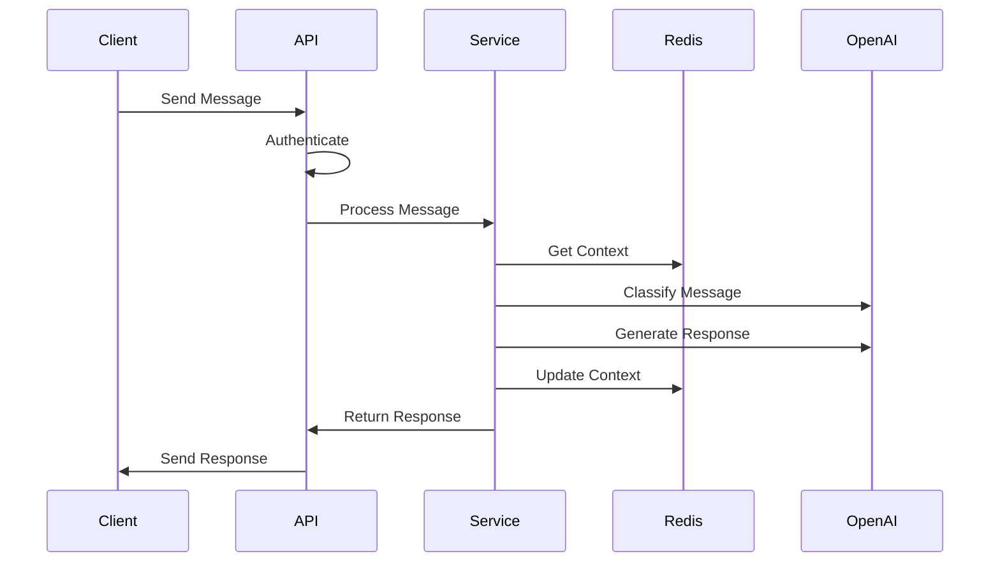

# Message Classification Service - System Design

## 1. System Overview

### 1.1 Architecture Diagram
```
┌─────────────────┐     ┌──────────────────┐     ┌─────────────────┐
│   Client Apps   │────▶│   API Gateway    │────▶│ Load Balancer   │
└─────────────────┘     └──────────────────┘     └────────┬────────┘
                                                          │
                                                          ▼
┌─────────────────┐     ┌──────────────────┐     ┌─────────────────┐
│  Redis Cluster  │◀───▶│  Service Nodes   │◀───▶│   OpenAI API    │
└─────────────────┘     └──────────────────┘     └─────────────────┘
         │                       │
         │               ┌───────┴───────┐
         │               │               │
         ▼               ▼               ▼
┌─────────────────┐ ┌──────────┐  ┌──────────────┐
│  Message Queue  │ │ Metrics  │  │    Logs      │
└─────────────────┘ └──────────┘  └──────────────┘
```

### 1.2 Key Components

1. **API Layer**
   - REST API endpoints
   - JWT Authentication
   - Rate limiting
   - Request validation

2. **Service Layer**
   - Message classification
   - Flow management
   - Context handling
   - AI response generation

3. **Data Layer**
   - Redis for context/session storage
   - Message history
   - User state management

4. **AI Integration**
   - LangChain
   - OpenAI GPT models
   - Classification logic

## 2. Technical Architecture

### 2.1 Service Components

```typescript
// High-level component structure
interface ServiceArchitecture {
  api: {
    endpoints: {
      message: '/api/sendMessage',
      checkIn: '/api/initiateCheckIn',
      context: '/api/retrieveContext',
      contextUpdate: '/api/updateContext'
    },
    middleware: {
      auth: 'JWT',
      rateLimit: '100/15min',
      validation: 'Zod'
    }
  },
  services: {
    message: 'MessageService',
    context: 'ContextService',
    ai: 'AIService',
    flow: 'FlowManager'
  },
  storage: {
    type: 'Redis',
    patterns: ['Pub/Sub', 'Cache', 'Session']
  },
  ai: {
    provider: 'OpenAI',
    framework: 'LangChain',
    models: ['gpt-3.5-turbo']
  }
}
```

### 2.2 Data Flow



## 3. Scalability Considerations

### 3.1 Horizontal Scaling
```yaml
scaling:
  service:
    type: kubernetes
    components:
      - api-nodes
      - service-nodes
      - redis-cluster
    autoscaling:
      metrics:
        - cpu: 70%
        - memory: 80%
      min: 2
      max: 10

  redis:
    type: cluster
    shards: 3
    replicas: 2
```

### 3.2 Performance Optimizations
```typescript
interface Performance {
  caching: {
    context: '24h TTL',
    responses: '1h TTL',
    classification: '15m TTL'
  },
  batching: {
    messages: 'MessageQueue',
    aiRequests: 'BatchProcessor'
  },
  optimization: {
    contextPruning: '10 messages',
    responseTimeout: '5s',
    retryStrategy: 'exponential'
  }
}
```

## 4. Security Architecture

### 4.1 Authentication & Authorization
```typescript
interface Security {
  authentication: {
    type: 'JWT',
    expiry: '24h',
    refresh: true
  },
  encryption: {
    atRest: 'AES-256',
    inTransit: 'TLS 1.3'
  },
  rateLimit: {
    window: '15m',
    max: 100,
    userBased: true
  }
}
```

### 4.2 Data Protection
```yaml
security:
  data:
    pii:
      encryption: true
      masking: true
    messages:
      retention: '30 days'
      encryption: true
  access:
    rbac: true
    audit: true
```

## 5. Monitoring & Observability

### 5.1 Metrics
```typescript
interface Monitoring {
  metrics: {
    response: {
      latency: 'histogram',
      success: 'counter',
      errors: 'counter'
    },
    ai: {
      callDuration: 'histogram',
      tokenUsage: 'counter',
      errors: 'counter'
    },
    redis: {
      operations: 'counter',
      latency: 'histogram',
      memory: 'gauge'
    }
  }
}
```

### 5.2 Logging
```yaml
logging:
  levels:
    - error
    - warn
    - info
    - debug
  components:
    - api
    - service
    - redis
    - ai
  format: JSON
  retention: '7 days'
```

## 6. Deployment Architecture

### 6.1 Container Configuration
```dockerfile
# Multi-stage build
FROM node:18-alpine AS builder
WORKDIR /app
COPY package*.json ./
RUN npm ci
COPY . .
RUN npm run build

FROM node:18-alpine
WORKDIR /app
COPY --from=builder /app/dist ./dist
COPY package*.json ./
RUN npm ci --production
CMD ["npm", "start"]
```

### 6.2 Kubernetes Configuration
```yaml
deployment:
  apiVersion: apps/v1
  kind: Deployment
  spec:
    replicas: 3
    strategy:
      type: RollingUpdate
    containers:
      - name: message-service
        image: message-service:latest
        resources:
          limits:
            cpu: "1"
            memory: "1Gi"
          requests:
            cpu: "500m"
            memory: "512Mi"
        env:
          - name: NODE_ENV
            value: production
        readinessProbe:
          httpGet:
            path: /health
            port: 3000
```

## 7. Error Handling & Resilience

### 7.1 Error Handling Strategy
```typescript
interface ErrorHandling {
  retries: {
    ai: {
      maxAttempts: 3,
      backoff: 'exponential'
    },
    redis: {
      maxAttempts: 2,
      backoff: 'linear'
    }
  },
  fallbacks: {
    classification: 'NORMAL',
    response: 'default_response',
    context: 'empty_context'
  },
  circuit_breaker: {
    threshold: 0.5,
    resetTimeout: '30s'
  }
}
```

### 7.2 Health Checks
```yaml
health:
  endpoints:
    - /health/live
    - /health/ready
  checks:
    - redis
    - openai
    - message_processing
  interval: 30s
  timeout: 5s
```

## 8. Future Considerations

### 8.1 Scalability Improvements
- Message queue implementation for async processing
- Caching layer for frequently accessed contexts
- Read replicas for Redis
- Geographic distribution

### 8.2 Feature Enhancements
- Multi-language support
- Custom AI model training
- Advanced analytics
- Real-time notifications
- Webhook integrations

## 9. Development Workflow

### 9.1 Local Development
```bash
# Development setup
npm install
npm run dev

# Testing
npm test
npm run test:coverage

# Linting & Formatting
npm run lint
npm run format
```

### 9.2 CI/CD Pipeline
```yaml
pipeline:
  stages:
    - build
    - test
    - security_scan
    - deploy_staging
    - integration_tests
    - deploy_production
  triggers:
    - push: main
    - pull_request
```
